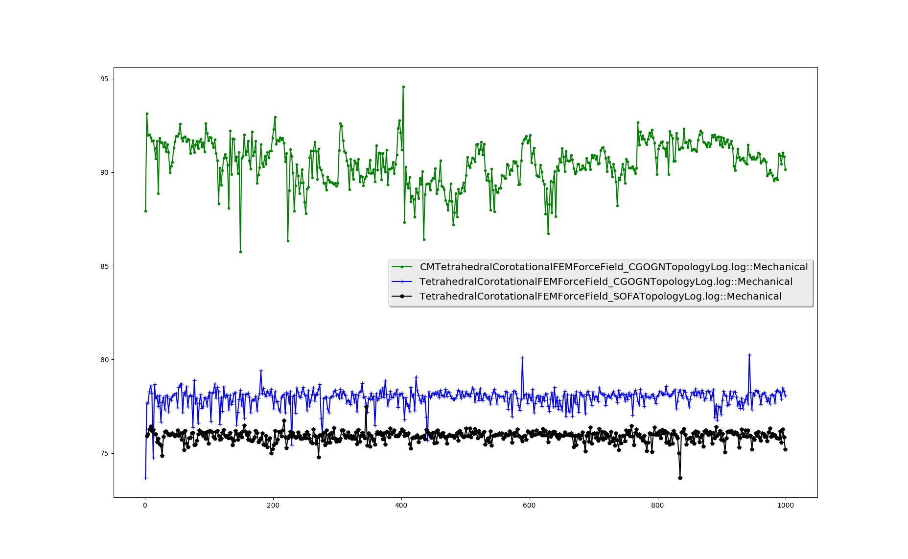

---
title: Test de benchmark SOFA/CGOGN
date: 2017-08-10
author:
- Guillaume Grosshenny
geometry: margin=2cm
...

\newpage

\tableofcontents

\newpage

Mise en situation
=================

Ce test a été réalisé pour 1 000 pas de simulation avec une capture de temps tous les deux pas de simulations. Les scènes étudiées comportent les même composants, à savoir : un modèle d'une poutre au format VTK, sur laquelle sont appliquées deux *BOXROI*, la topologie utilisée varie en fonction de la scène : il y a, à chaque fois que cela était possible, la topologie *SOFA* ou *CGOGN* avec un *"forcefield"* SOFA (*TetrahedronFEMForcefield*) ou CGOGN (*CMTetrahedronFEMForcefield*) pour chaque topologie. La première *BOXROI* fixe le bout de la poutre dans l'espace et la deuxième tire l'autre bout vers l'avant. La représentation de l'utilisation du CPU en pourcentage pour l'élément "Mechanical" avec ses sous-composants sont disponibles sur les graphiques.

Résultats
=========

La figure 1 est celle représentant la capture de temps pour les trois scènes. Les deux premières scènes comportent la topologie *CGOGN* : *TetrahedronFEMForcefieldCGOGN* et *CMTetrahedronFEMForcefieldCGOGN*, la dernière scène est comporte la topologie *SOFA*. Nous prenons le composant *Mechanical* pour les mesures de temps exprimées en pourcentage d'utilisation du temps CPU. 

Lors de l'analyse des courbes, nous pouvons apercevoir que le composant mechanical prend, en moyenne, entre 76 et 78 % du temps d'utilisation du CPU par rapport au temps CPU total utilisé pour la simulation avec la topologie *CGOGN* et le *TetrahedronFEMForcefield*, entre 84 et 94 % pour la scène utilisant la topologie *CGOGN* et le *CMTetrahedronFEMForcefield* et entre 74 et 76 % pour la scène utilisant la topologie *SOFA* et le *TetrahedronFEMForcefield*. On observe également que lors de l'avancement de la simulation, le pourcentage d'utilisation CPU dépasse rarement les bornes citées précédement.

