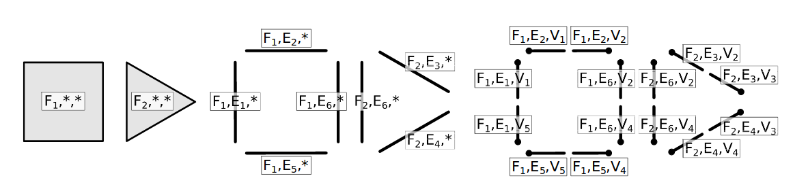
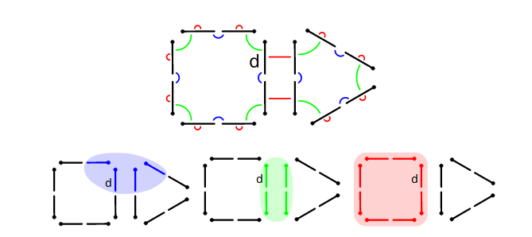

---
title: Notes sur l'article CGOGN
date: 2017-07-10
author:
- Guillaume Grosshenny
...

\newpage

\tableofcontents

\newpage

Introduction
============

Les meshs sont une décomosition cellulaires d'un objet géométrique *(courbes, surfaces, volumes)*. Il y a différents niveaux de cellules *(sommets, arrêtes, faces et volumes)* et chaque niveau peut avoir sa propre topologie. CGOGN se base sur les relations entre ces cellules, notamment l'incidence et l'adjacence. 

Une des façons simples de représenter les relations d'incidence entre les différentes cellules est de créer un graphe appelé *graphe d'incidence*. Cependant le parcours de ce graphe est coûteux, puisqu'il faut parcourir toutes les relations pour en trouver une spécifique. Une alternative à ce graphe d'incidence est la carte combinatoire, bien plus efficace.

Carte combinatoire (principe)
=============================

### Cell-tuples

Le principe du cell-tuple est d'utiliser la déomposition cellulaire d'un mesh et les niveaux des cellules de cette décomposition. Les niveaux utilisés sont : *les faces, les arrêtes et les sommets*. Chaque cellule est définie par un tuple comme suit : (<Face>, <Arrête>, <Sommet>). On dit qu'une cellule *i* est adjacente à une autre cellule si elles ont en commun tous les autres niveaux de cellules, sauf le niveau *i*. Pour exemple, les cellules (F1, E1, V1) et (F1, E1, V2) où F1 est une face, E1 une arrête et V1 et V2 des sommets, sont adjacentes.

 

### Carte généralisée

Une carte généralisée *(ou generalized map)* est une décomposition d'un meshs en ensemble $D$ d'éléments abstraits $d$ appelés des *darts*. Chaque dart correspond à un cell-tuple comme vu précédement sur la figure 1. Pour passer d'un dart à un autre en suivant la relation d'adjacence entre les cell-tuple. Des fontions $\alpha_{i} : D \to D, 0 \le i \le n$ permettent de passer d'un dart $d_{n}$ à un dart $d_{m}$ $(m \ne n)$ via le niveau de cellule i.

En partant d'un *dart*, on peut trouver l'ensemble des *darts* permettant de représenter un niveau de cellule donné. On appelle ces ensembles des *orbites*, comme apr exemple : $< \alpha_{1}, \alpha_{2} > (d)$ pour représenter les arrêtes liés au sommet du dart d, $< \alpha_{0}, \alpha_{2} > (d)$ pour représenter les points autour de l'arrête du dart et $< \alpha_{0}, \alpha_{1} > (d)$ pour la face.

### Carte combinatoire orientée

Chaque *dart* a une couleur attribuée : noir ou blanc et un *dart* ne peut être relié qu'à un *dart* de l'autre couleur que la sienne. C'est comme ça qu'est créé l'orientation d'un objet. Pour constituer les cellules, le principe des *orbites* est concervé mais en utilisant des compositions des fonctions $\alpha_{i}$.

### Carte raffinée

Afin de simplifier le stockage des données sur les cellules, chacune d'elle a un indice et les données y sont rattachées dans un tableau. Chaque *dart* a donc un indice et *l'orbite* d'un *dart* aura le même indice que ce dernier.

Implementation
==============

### Stockage des données

Les données sont stockées sous forme de tableaux dynamiques où chaque *dart* est composé des indices : du *dart* suivant, du *dart* précédent, les sommets et les faces qui le composent. Les sommets et les faces sont eux-mêmes stockés dans des tableaux. Les données sont stockées dans des *chunks* qui sont des regroupements de listes chaînées.

### Gestion des attributs

La gestion des attributs (ajout, suppression et récupération) est gèrée par des objets appelés *AttributeHandler* qui offrent des méthodes génériques pour effectuer cette gestion avec la même méthode pour tous les cas possibles.

### Gestion des bordures

CGOGN ne prend en compte que les meshs clos, cependant, il peut être utile de créer des meshs non-clos. Or un *dart* doit en posséder trois autres comme voisins, sous peine de ne pas prendre en compte tous les autres *darts* de son orbites. Là où normalement le troisième *dart* est celui de la face adjacente, dans le cas de la bordure, il est inexistant. Concidérer ce troisième *dart* comme un point fixe ne règle pas le problème, il faut donc ajouter des *darts virtuels* au niveau des bordures afin d'y remédier.

### Fonctions de parcours

Plusieurs méthodes de parcours sont utilisées, toutes basées sur les notions d'incidence et d'adjacence entre les *cellules*.
